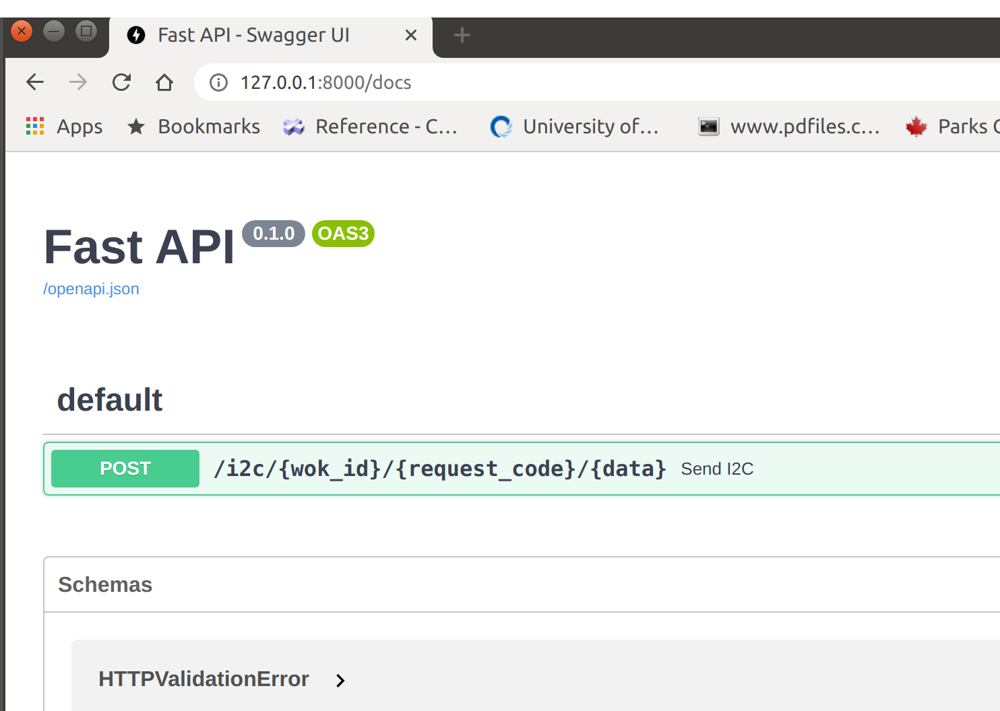
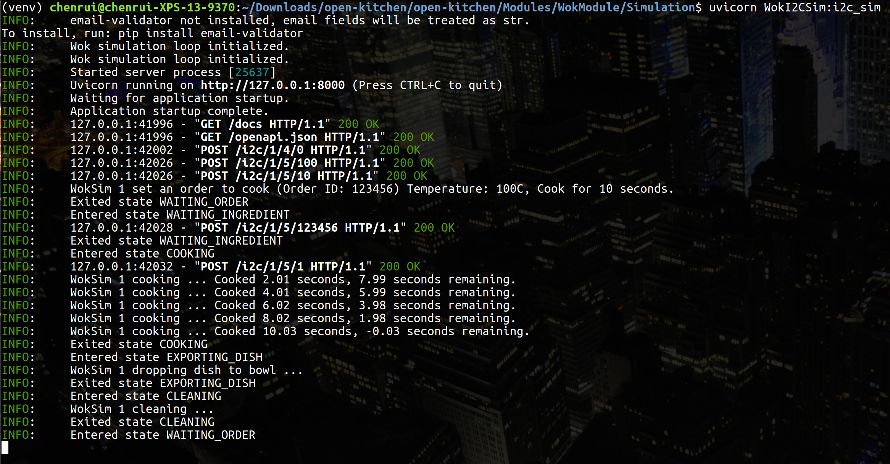

# Wok Simulation

This Wok simulation contrains two parts,
1. **WokSim**: the core hardware level single wok simulation
2. **WokI2CSim**: the Wok(s) simulation on simulated I2C interface


# Virtual Environment Setup

You will need to setup a virtual environment to run the wok simulation. Here are the instruction to setup a python
 virtual environment using virtualenv,
 
```bash
virtualenv <environment_name>           # Create virtual environment
source ./<environment_name>/bin/active  # Activate virtual environment
pip install -r requirements.txt         # Install requirement at runtime
pip install -r requirements-dev.txt     # Install requirement for development
```

The `requirements.txt` and `requirements-dev.txt` are store in the main root directory of this repository.

Once the virtual environment been setup, go to directory `Modules/WokModule/Simulation` in this repository so you are
 ready to run Wok simulation.


# Wok Behavior

The WokSim is the core of hardware level single wok simulation. It simulates the behavior of a wok which will only
 receive I2C request from the main controller (Raspberry Pi) and respond base on different request from the main
  controller. The overall workflow cycle of Wok component will be,

1. The Wok will initialized in the waiting order state, which will
    - Wait main controller to set heat temperature of cooking.
    - Wait main controller to set cooking duration in seconds.
    - Wait main controller to pass down the order id.
2. After the above parameter been set, the Wok goes into the waiting ingredients state which will
    - Wait main controller to notify if the ingredient is in the Wok.
3. Once main controller confirm the ingredient have been putted in the Wok, it goes into the cooking state which will
    - Heat the Wok to cooking temperature and cook for cooking duration.
4. Once the cooking time is up, the Wok will enter the exporting dish state which will
    - Drop dish into the bowl.
5. Finally, the Wok will gose to the cleaning state after droping dish into a bowl. It will 
    - Clean itself
6. The Wok will cycle back to the first step

The Wok also support to change cooking time and reset the Wok in any state.


# WokSim CLI
 
WokSim could be execute in terminal with the following command within the same direction of `WokSim.py`,

```bash
python WokSim.py
```

When it up and running, you should see something like the following screenshot,


Now, you are able to send request as the main controller will do to control the Wok simulation. Every time you send a
 request, the Wok should respond something. The available request from main controller to the Wok and the meaning
  of response are,
  
#### Main controller to Wok 
| Request code | Request Description | Data  | Response | Response Description
|:-------------|:--------------------|:------|:---------|:--------------------
| 1            | Get component code  |       | 1        | Wok component
|              |                     |       | 2        | Ingredient dispenser component
|              |                     |       | 3        | Sauce runner component
|              |                     |       | 4        | Transporter component
| 2            | Get state code      |       | 1        | Waiting order state
|              |                     |       | 2        | Waiting ingredient stat
|              |                     |       | 3        | Cooking state
|              |                     |       | 4        | Exporting dish state
|              |                     |       | 5        | Cleaning state
| 3            | Get error code      |       | 0        | No errors
|              |                     |       | 1        | Error: cooking terminates before cooking time complete
|              |                     |       | 2        | Error: the bowl is not in place for dish exporting
| 4            | Get Wok request code|       | 0        | Wok no request
|              |                     |       | 1        | Wok request to set heat degrees
|              |                     |       | 2        | Wok request to set cooking duration in seconds
|              |                     |       | 3        | Wok request to set order id
|              |                     |       | 4        | Wok request to notify if ingredients is ready (been put in the Wok)
| 5            | Respond Wok request | uint8 | 0        | Wok failed to save data and/or not able to setup
|              |                     |       | 1        | Wok successfully save data and/or setup
| 6            | Reset Wok           |       | 0        | Wok failed to reset
|              |                     |       | 1        | Wok successfully reset
| 7            | Reset cooking time  | uint8 | 0        | Wok failed to reset cooking duration
|              |                     |       | 1        | Wok successfully reset cooking duration


The available Wok to main controller request and the expected response meaning are,

#### Wok to main controller
| Request code | Request Description                     | Data  | Response | Response Description
|:-------------|:----------------------------------------|:------|:---------|:--------------------
| 0            | No request                              | 
| 1            | Request to set heat degrees             |       | uint8    | Heat degrees
| 2            | Request to set cooking duration         |       | uint8    | Cooking duration in seconds
| 3            | Request to set order id                 |       | string   | Order id
| 4            | Request to confirm if ingredients ready |       | 0        | Denied 
|              |                                         |       | 1        | Confirm

Therefore, we can use I2C request code `4` to check Wok request. So, if you type 4 in the WokSim command line and hit
 enter, you should see the following,
 
 
 As you can see, the WokSim response is `1`, which means the Wok is requesting us to set the heat degrees. We can use
  I2C request code `5` to respond Wok the heat degrees. You will notify that the command line ask you to enter the
   I2C data if we use I2C request code `5` which will allow you to enter the Wok heating degrees in Celsius. I will
    enter 100 as an example here, so you should see this,
 
 
 Since the WokSim respond `1` to me after I set up the heating degree, so it successfully setup the heating degrees
 . Now if you check the Wok request by using I2C request code `4`, you should find that changed to `2` which is
  requesting us to set the cooking duration in seconds.
 
 
 You can using the same process (reqeust code `5`) to setup the cooking duration and order id. After you setup those
  three parameters, the Wok should enter waiting ingredients state and you should see the screen below,
 
 
 Now, the Wok just waiting you to confirm if the ingredient is in the Wok. You can confirm that using request code `5
 ` and enter the data as `1`. Then, you should see WokSim is cooking. After the cooking time is up, it will go
  through exporting dish state and cleaning state and finally goes back to waiting order state. The screen you will
   see should be similar as the one in below
 
 
 Now, you can go over the same process to simulate another dish cooking process. You can type in `stop` in I2C
  request code field to exit the WokSim.
  
  
  
# WokI2CSim

WokI2CSim is an extension of the WokSim which use a RESTful API to simulate the I2C communication that could
 communicate with multiple Woks. WokI2CSim is simulating 2 Woks now. 
 
To bring it up use the following command in the same directory as `WokI2CSim.py`,
```bash
uvicorn WokI2CSim:i2c_sim
```

You should see something like this when it's up and running,
 
 
The RESTful API is hosting at `127.0.0.1:8000` and an user interface should be available if you visit `http://127.0.0
.1:8000/docs`. 
 
 
Then, you should able to control the Wok simulation using similar process as when we control the
 WokSim simulation. You can select `1` or `2` as the `wok_id`. Also, put `0` in the data field if a request doesn't
  has data part.
 
 
The response in this RESTful API will have some helper field that helps human to understand what is going on. For
 example, here is on of the response from Wok simulation,
 ```json
{
  "wok_id": 1,
  "raw_request": 4,
  "raw_response": 1,
  "request_description": "request wok action",
  "response_description": "The Wok request to set cooking temperature."
}
```
It includes the raw request code and raw response, it also includes the description of request and response to help
 human understand what the request code and response means.
 
Here is what you should see if you control Wok 1 to cook a dish at 100 Celcius for 10 seconds,
 
  
  
  
# The End
That's how you can use Wok simulation.
